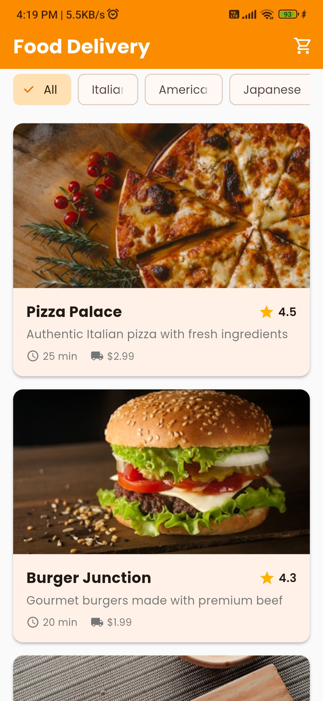
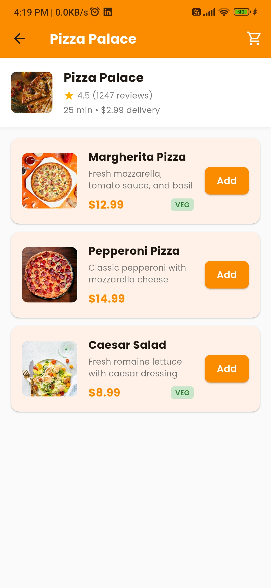
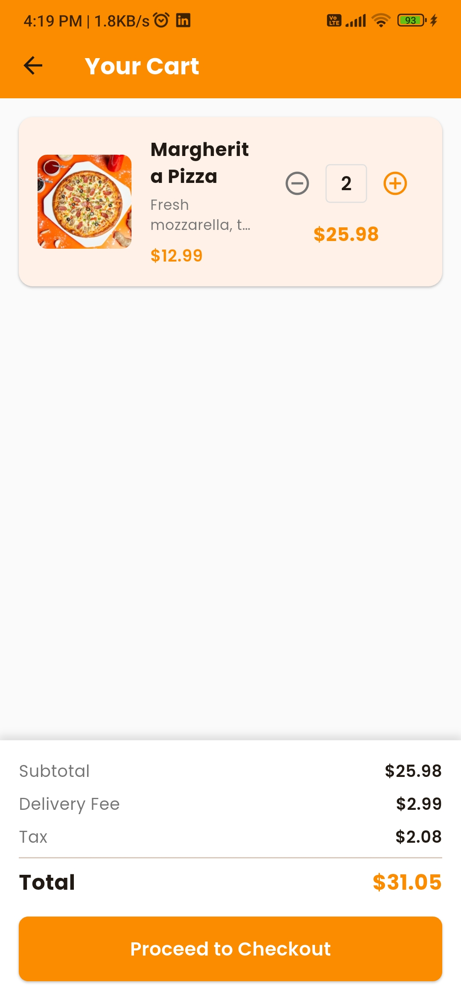
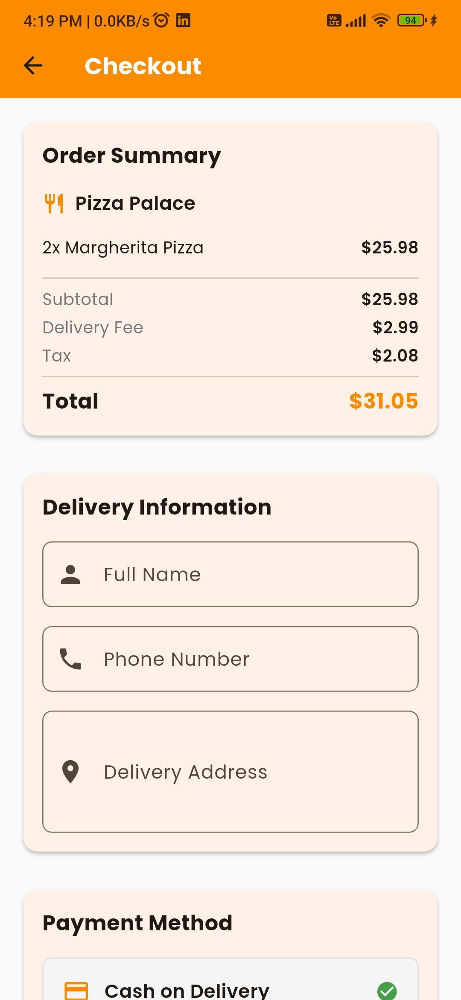
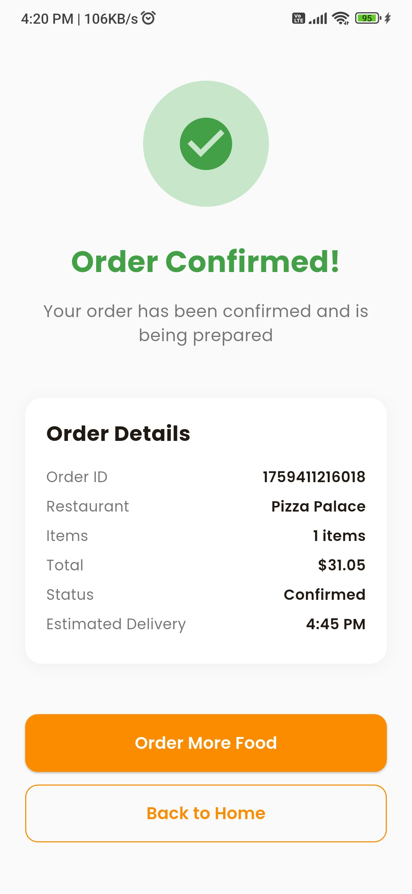

# Food Delivery App

A comprehensive Flutter food ordering application built with BloC architecture, featuring a complete workflow from restaurant selection to order confirmation.

## Features

- **Restaurant Discovery**: Browse local restaurants with filtering by cuisine type
- **Menu Browsing**: View detailed menus with food items, prices, and descriptions
- **Shopping Cart**: Add/remove items, update quantities, and view cart summary
- **Order Placement**: Complete checkout process with customer information
- **Order Tracking**: Real-time order status updates and confirmation
- **Error Handling**: Comprehensive error handling throughout the app
- **Responsive Design**: Beautiful, modern UI with smooth animations

## Architecture

This app follows **SOLID principles** and uses **BloC (Business Logic Component)** architecture for state management:

- **Models**: Data classes for Restaurant, FoodItem, CartItem, and Order
- **Bloc**: State management with events, states, and business logic
- **Services**: Mock data service for restaurant and menu information
- **Screens**: UI components for each step of the ordering workflow
- **Tests**: Comprehensive unit tests for models and BloC logic

## Screenshots

### Restaurant List Screen

*Browse available restaurants with category filtering*

### Restaurant Menu Screen

*View menu items and add to cart*

### Shopping Cart Screen

*Manage cart items and quantities*

### Checkout Screen

*Enter delivery information and place order*

### Order Confirmation Screen

*Order confirmation with tracking details*

## Getting Started

### Prerequisites

- Flutter SDK (3.9.0 or higher)
- Dart SDK
- Android Studio / VS Code with Flutter extensions

### Installation

1. **Clone the repository**
   ```bash
   git clone <repository-url>
   cd assigment
   ```

2. **Install dependencies**
   ```bash
   flutter pub get
   ```

3. **Run the app**
   ```bash
   flutter run
   ```

### Running Tests

```bash
# Run all tests
flutter test

# Run tests with coverage
flutter test --coverage
```

## Project Structure

```
lib/
├── bloc/
│   ├── food_ordering_bloc.dart      # Main BloC implementation
│   ├── food_ordering_event.dart     # BloC events
│   └── food_ordering_state.dart    # BloC states
├── models/
│   ├── food_item.dart               # Food item data model
│   ├── restaurant.dart              # Restaurant data model
│   ├── cart_item.dart               # Cart item data model
│   └── order.dart                   # Order data model
├── screens/
│   ├── restaurant_list_screen.dart   # Restaurant listing screen
│   ├── restaurant_menu_screen.dart   # Menu browsing screen
│   ├── cart_screen.dart             # Shopping cart screen
│   ├── checkout_screen.dart         # Checkout process screen
│   └── order_confirmation_screen.dart # Order confirmation screen
├── services/
│   └── mock_data_service.dart       # Mock data service
└── main.dart                        # App entry point

test/
├── models/
│   ├── food_item_test.dart          # Food item model tests
│   └── cart_item_test.dart          # Cart item model tests
└── bloc/
    └── food_ordering_bloc_test.dart # BloC logic tests
```

## Key Features Implementation

### BloC Architecture
- **Events**: User actions like `LoadRestaurants`, `AddToCart`, `PlaceOrder`
- **States**: UI states like `loading`, `loaded`, `error`, `orderPlaced`
- **Bloc**: Business logic handling state transitions and data processing

### Error Handling
- Network error simulation with retry functionality
- Form validation with user-friendly error messages
- Graceful error states with recovery options

### State Management
- Immutable state objects using Equatable
- Predictable state transitions
- Reactive UI updates based on state changes

### UI/UX Design
- Material Design 3 components
- Google Fonts (Poppins) for typography
- Smooth animations and transitions
- Responsive layout for different screen sizes
- Consistent color scheme with orange primary color

## Dependencies

- `flutter_bloc`: State management
- `equatable`: Value equality for models
- `google_fonts`: Typography
- `cached_network_image`: Image loading and caching
- `bloc_test`: Testing BloC logic
- `mocktail`: Mocking for tests

## Workflow

1. **Restaurant Selection**: Users browse restaurants by category
2. **Menu Browsing**: View restaurant menu with detailed food items
3. **Cart Management**: Add items, adjust quantities, view cart summary
4. **Checkout Process**: Enter delivery information and payment details
5. **Order Confirmation**: Receive order confirmation with tracking information

## Testing

The app includes comprehensive unit tests covering:
- Model equality and copyWith methods
- BloC state transitions and business logic
- Error handling scenarios
- Cart operations (add, remove, update quantities)

## Future Enhancements

- Real API integration
- User authentication and profiles
- Order history and tracking
- Push notifications
- Payment gateway integration
- Restaurant reviews and ratings

## Contributing

1. Fork the repository
2. Create a feature branch
3. Make your changes
4. Add tests for new functionality
5. Submit a pull request
